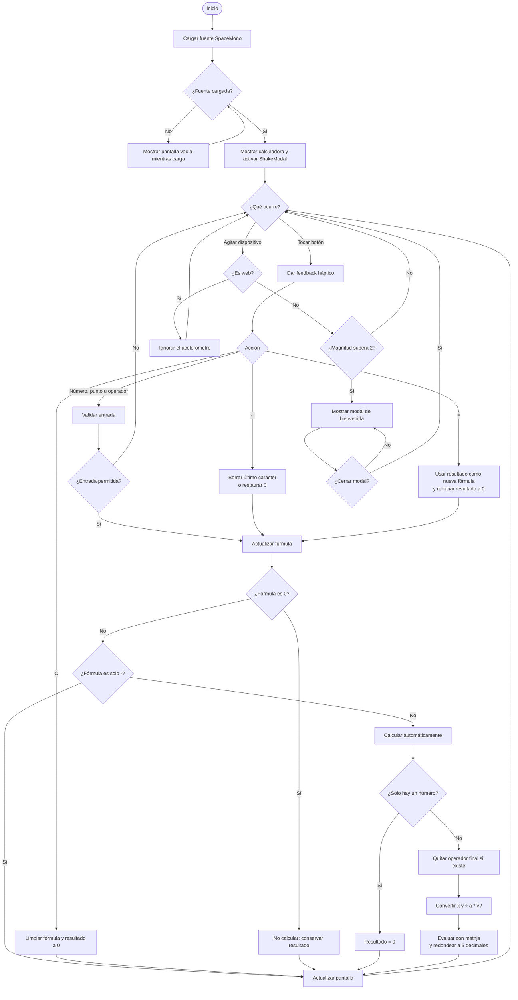

# Flow chart de Kalku

```mermaid
flowchart TD
    A([Inicio]) --> B[Cargar fuente SpaceMono]
    B --> C{¿Fuente cargada?}
    C -- No --> D[Mostrar pantalla vacía mientras carga]
    D --> C
    C -- Sí --> E[Mostrar calculadora y activar ShakeModal]

    E --> F{¿Qué ocurre?}
    F -- Tocar botón --> G[Dar feedback háptico]
    G --> H{Acción}
    H -- C --> I[Limpiar fórmula y resultado a 0]
    H -- ← --> J[Borrar último carácter<br/>o restaurar 0]
    H -- Número, punto u operador --> K[Validar entrada]
    K --> L{¿Entrada permitida?}
    L -- No --> F
    L -- Sí --> M[Actualizar fórmula]
    M --> N{¿Fórmula es 0?}
    N -- Sí --> O[No calcular; conservar resultado]
    N -- No --> N2{¿Fórmula es solo -?}
    N2 -- Sí --> V
    N2 -- No --> P[Calcular automáticamente]
    P --> Q{¿Solo hay un número?}
    Q -- Sí --> R[Resultado = 0]
    Q -- No --> S[Quitar operador final si existe]
    S --> T[Convertir x y ÷ a * y /]
    T --> U[Evaluar con mathjs<br/>y redondear a 5 decimales]
    I --> V[Actualizar pantalla]
    J --> M
    O --> V
    R --> V
    U --> V
    V --> F
    H -- = --> W[Usar resultado como nueva fórmula<br/>y reiniciar resultado a 0]
    W --> M

    F -- Agitar dispositivo --> X{¿Es web?}
    X -- Sí --> Y[Ignorar el acelerómetro]
    X -- No --> Z{¿Magnitud supera 2?}
    Z -- No --> F
    Z -- Sí --> AA[Mostrar modal de bienvenida]
    AA --> AB{¿Cerrar modal?}
    AB -- No --> AA
    AB -- Sí --> F
    Y --> F
```

La fórmula y el resultado se muestran en pantalla; el resultado se recalcula al cambiar la fórmula. Los botones también producen feedback háptico.
